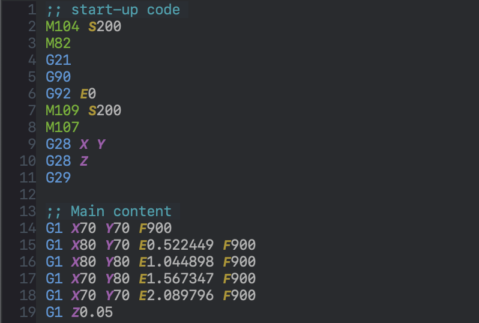

# Table of Contents

1.  [Features](#org1dab8b0)
    1.  [Syntax Highlighting](#org8fd1c77)

gcode-mode.el is a major mode for editing gcode files in emacs.

# Features

Currently the only feature is syntax highlighting.

## Syntax Highlighting

-   Instruction codes.
-   Comments

